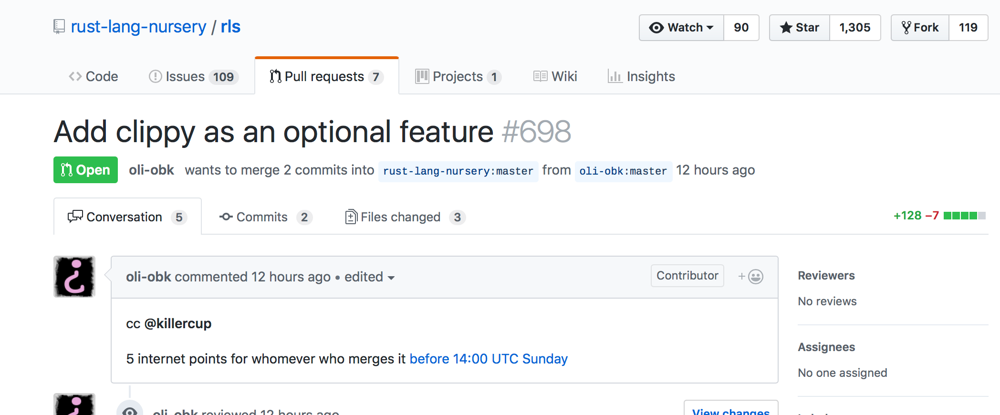
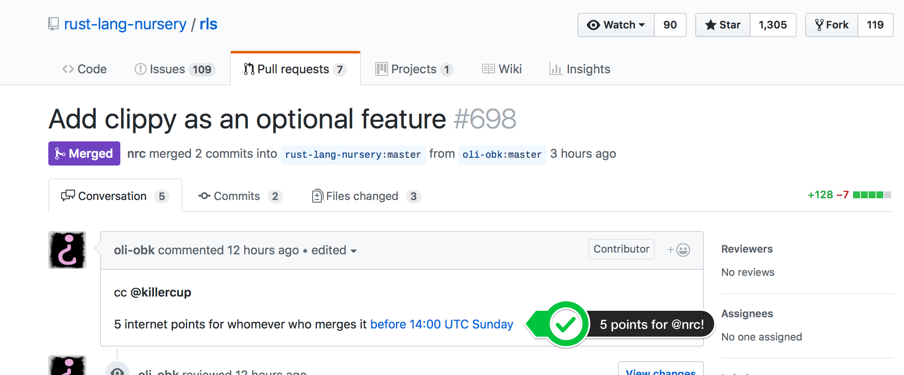
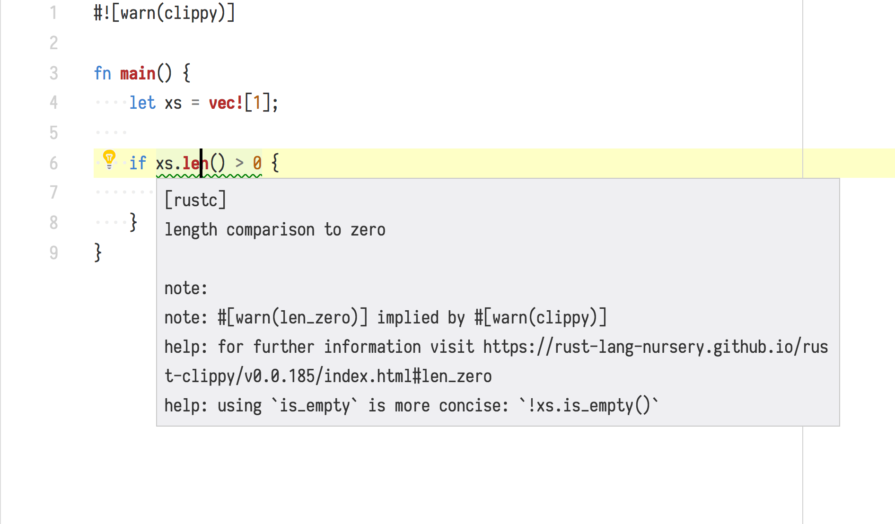
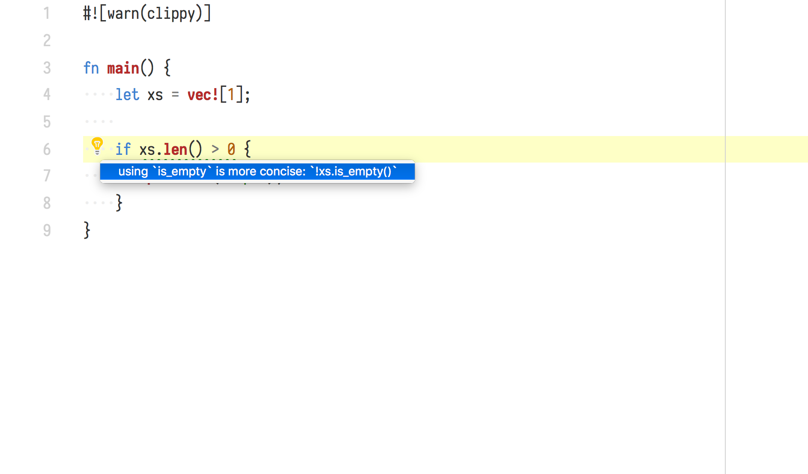
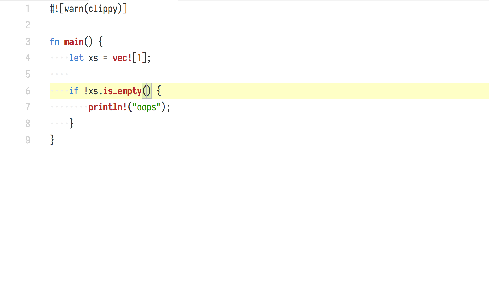
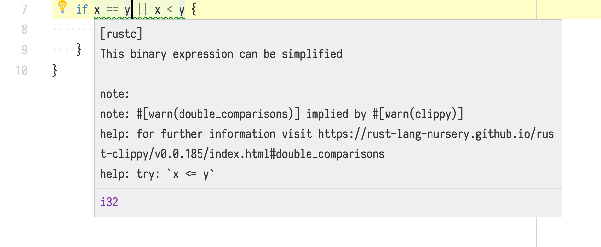
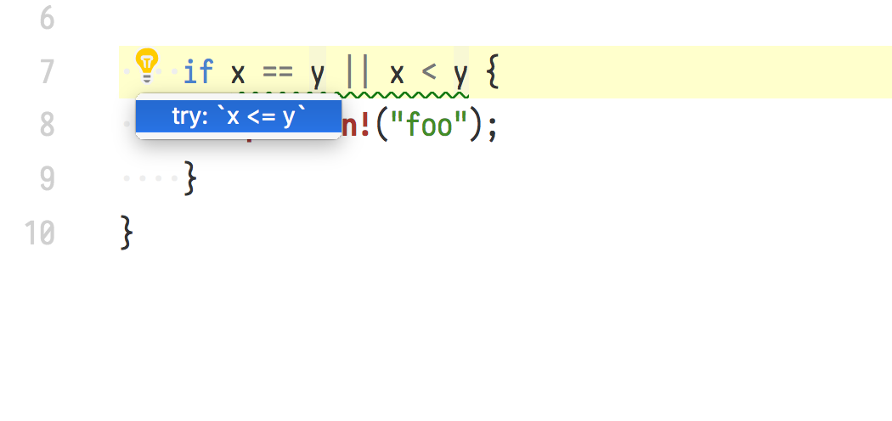
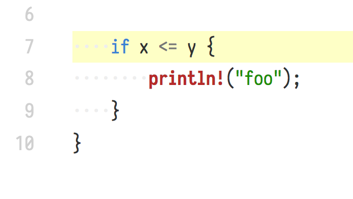
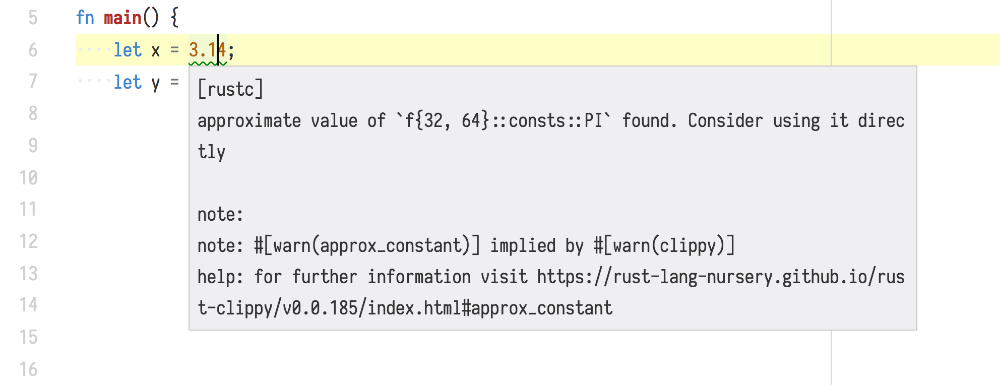

## Hi, I'm Pascal Hertleif

- Web dev & Rust freelancer
- Co-organizer of [Rust Cologne]
- {[twitter],[github]}.com/killercup
- Rust-centric blog: [deterministic.space]

[Rust Cologne]: http://rust.cologne/
[twitter]: https://twitter.com/killercup
[github]: https://github.com/killercup
[deterministic.space]: https://deterministic.space/

::: notes

Thanks for the kind introduction!

- I've been working with Rust since early 2014
- If you ever happen to be in Cologne, drop by at one of our monthly meetups!
- And with that out of the way, let's get started!

:::

# Rust programmers like compiler errors

::: notes

Let's start with something uncontroversial:
Rust programmers like compiler errors

:::

---

```
error[E0507]: cannot move out of borrowed content
   --> src/lib.rs:126:29
    |
126 |         if let Some(code) = diagnostic.code {
    |                     ----    ^^^^^^^^^^ cannot move out of borrowed content
    |                     |
    |                     hint: to prevent move, use `ref code` or `ref mut code`
```

## Why?

Rust is all about compile-time checks

But also: Rust's errors are *pretty* and *helpful*

## Warnings, too

- Lints
- _Prevent_ errors
- Examples
	- unused `Result`s or `Iterator`s
	- Missing docs

## Clippy

It looks like you're enjoying errors. Would you like some more?

- 208 lints written by the community
- Find common bugs
	- For example: `if_same_then_else`

::: notes

Clippy was originally written by Manish Goregaokar
but there are a lot of people who contributed to it.
Oliver here, for example!

:::

# Lints as a teaching tool

---

`iter.filter(|x| x == 0).next()`

. . .

Did you know about `iter.find(|x| x == 0)`?

::: notes

Are there any seasoned Rust developers here
who know a better way to write this?

:::

---

`if !m.contains_key(&k) { m.insert(k, v) }`

. . .

Have you heard the good news about the Entry API?

`m.entry(k).or_insert(v);`

::: notes

Okay, you get another chance!
How about this code?
What would you change?

The Entry API only needs to compute the hash once!

:::

---

- Learn new APIs when you are _almost_ using them
- Each clippy lint is documented with examples

::: notes

This is really powerful,
as you get the chance to learn something
very close to when you where thinking about how to solve this problem.
So you are not reading a book
and much later try to apply you knowledge,
but get to learn things by working on your own code.

:::

# Making this interactive

---

## Suggestions

```
error: this range is empty so this for loop will never run
   --> $DIR/for_loop.rs:148:14
    |
148 |     for i in 10..0 {
    |              ^^^^^
    |
    = note: `-D reverse-range-loop` implied by `-D warnings`
help: consider using the following if you are attempting to iterate over this range in reverse
    |
148 |     for i in (0..10).rev() {
    |              ^^^^^^^^^^^^^
```

::: notes

The compiler can give you suggestions based on your code.
Many of these suggestions you can copy and paste to your code

:::

## Why fix it yourself?

I'm sold. These suggestions are great. But…

- don't make me type
- don't make me wait
- just fix my code already

# Presenting: rustfix

---

## It's already there

No magic! Just:

- Take existing errors
- Parse the compiler output (JSON)
- Apply suggestions (search & replace)

::: notes

The rustfix tool is really basic.
It uses the already existing building blocks.
I can't take any credit for those!

:::

## Make it interactive (1)

rustfix as CLI tool is interactive

- for each error (that has a suggestion) it
	- shows you the error and the fix(es)
	- asks what you want to do
	- fixes your code

## Make it interactive (2)

You need to manually call the CLI tool

You do that after working on the code

We can do better

# Fixes via IDE

---

## RLS

- Rust Language Server exposes warnings and suggestions
- VSCode plugin can already apply fixes

---



---



# Demo

---

> Laptop didn't work?
>
> Totally saw that coming.
>
> – Past Me

---



---



---



---



---



---



---



---


# Deep dive!

## How does this work?

- Compiler plugin
- Find nodes and items of interest
- 'Annotate' spans of code
- Compiler generates human/JSON output

## What is auto-fixable?

> - A lot!
> - Do we need to make a list?
> - Rust PR [#47540] adds flag for "approximate suggestions"
> - rustfix-like tools will use this in the future
> - **UPDATE** Merged! 🎉

[#47540]: https://github.com/rust-lang/rust/pull/47540

# Thanks!

## You can contribute lints and suggestions!

Search for "Rust Clippy" or go to <https://github.com/rust-lang-nursery/rust-clippy>

There are a lot of issues labelled _good first issue_

You get to call yourself a compiler hacker!

## Any questions?

Visit [rust-lang.org](https://www.rust-lang.org)

Follow me on Twitter: [\@killercup][twitter]

Slides available at [git.io/fosdem-rustfix](https://git.io/fosdem-rustfix)
